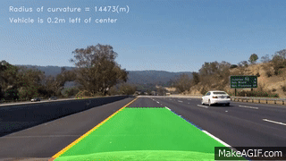

---

**Advanced Lane Finding Project**

The goals / steps of this project are the following:

* Compute the camera calibration matrix and distortion coefficients given a set of chessboard images.
* Apply a distortion correction to raw images.
* Use color transforms, gradients, etc., to create a thresholded binary image.
* Apply a perspective transform to rectify binary image ("birds-eye view").
* Detect lane pixels and fit to find the lane boundary.
* Determine the curvature of the lane and vehicle position with respect to center.
* Warp the detected lane boundaries back onto the original image.
* Output visual display of the lane boundaries and numerical estimation of lane curvature and vehicle position.

[//]: # (Image References)

[image1]: ./examples/undistort_output_M.png "Undistorted"
[image2]: ./examples/undistort_real.png "Road Transformed"
[image3]: ./examples/thres_prep.png "image processing"
[image4]: ./examples/thres_output.png "Binary"
[image5]: ./examples/warped.png "Warped"
[image6]: ./examples/histogram.png "Detect Lane"
[image7]: ./examples/windoed.png "Lanef Fit "
[image8]: ./examples/formula.jpg "Curvature"
[image9]: ./examples/result.png "Output"
[video1]: ./project_video.mp4 "Video"

## [Rubric](https://review.udacity.com/#!/rubrics/571/view) Points
###Here I will consider the rubric points individually and describe how I addressed each point in my implementation.  

---
### Writeup / README

#### 1. Provide a Writeup / README that includes all the rubric points and how you addressed each one.  You can submit your writeup as markdown or pdf.  [Here](https://github.com/udacity/CarND-Advanced-Lane-Lines/blob/master/writeup_template.md) is a template writeup for this project you can use as a guide and a starting point.  

You're reading it, enjoy!

### Camera Calibration

#### 1. Briefly state how you computed the camera matrix and distortion coefficients. Provide an example of a distortion corrected calibration image.

The code for this step is contained in the 3rd block cell of the IPython notebook located in this repository of the file called `advanced-lane-lines.ipynb`.  

I start by preparing "object points", which will be the (x, y, z) coordinates of the chessboard corners in the world. Here I am assuming the chessboard is fixed on the (x, y) plane at z=0, such that the object points are the same for each calibration image.  Thus, `objp` is just a replicated array of coordinates, and `objpoints` will be appended with a copy of it every time I successfully detect all chessboard corners in a test image.  `imgpoints` will be appended with the (x, y) pixel position of each of the corners in the image plane with each successful chessboard detection.  

I then used the output `objpoints` and `imgpoints` to compute the camera calibration and distortion coefficients using the `cv2.calibrateCamera()` function.  I applied this distortion correction to the test image using the `cv2.undistort()` function and obtained this result: 
![alt text][image1]

### Pipeline (single images)

#### 1. Provide an example of a distortion-corrected image.
To demonstrate this step, I will describe how I apply the distortion correction to one of the test images like this one:
![alt text][image2]

the output from camera camera calibration `objpoints` and `imgpoints` is applied here using `cv2.calibrateCamera()` function.  I applied this distortion correction to the test image using the `cv2.undistort()`.

#### 2. Describe how (and identify where in your code) you used color transforms, gradients or other methods to create a thresholded binary image.  Provide an example of a binary image result.

I used a combination of color and gradient thresholds to generate a binary image (locate this at the `Threshold image` section of the file ).  Here's an example of my process for this step.  
![alt text][image3]

and Here's an example of my process result for this step.  
![alt text][image4]


#### 3. Describe how (and identify where in your code) you performed a perspective transform and provide an example of a transformed image.

The code for my perspective transform includes a function called `cal_perspective()`, which appears in section `Perspective Transform ( birds-eye view)` of the file.  The `cal_perspective()` function takes as inputs an undistorted image.  

This resulted in the following source and destination points:

| Source        | Destination   | 
|:-------------:|:-------------:| 
| 490, 482      | 0, 0          | 
| 810, 482      | 1280, 720     |
| 1250, 720     | 1250, 720     |
| 40, 702       | 40, 0         |

I verified that my perspective transform was working as expected by drawing the `src` and `dst` points onto a test image and its warped counterpart to verify that the lines appear parallel in the warped image.

![alt text][image5]

#### 4. Describe how you identified lane-line pixels and fit their positions with a polynomial?

In the `Finding Lanes` section of the file I use a portion of the image to get an approximation fo the lanes position using a histogram approach

![alt text][image6]

and then I scan sectiond of the image in order to detect lane presence to convert those positions in a curve using 
a 2nd order polynomial to get soemthing like this:

![alt text][image7]

#### 5. Describe how  you calculated the radius of curvature of the lane and the position of the vehicle with respect to center.

based on [this amazing tutorial](http://www.intmath.com/applications-differentiation/8-radius-curvature.php)  I applied the next formuala found in `Finding Lanes` to calculate curvature and 
![alt text][image8]

#### 6. Provide an example image of your result plotted back down onto the road such that the lane area is identified clearly.

I implemented this step in `Finding Lanes` section in the function `cal_fill_lines()`.  Here is an example of my result on a test image:

![alt text][image9]

---

### Pipeline (video)

#### 1. Provide a link to your final video output.  Your pipeline should perform reasonably well on the entire project video (wobbly lines are ok but no catastrophic failures that would cause the car to drive off the road!).


Here's a  [](project_videoOut.mp4)

---

### Discussion

#### 1. Briefly discuss any problems / issues you faced in your implementation of this project.  Where will your pipeline likely fail?  What could you do to make it more robust?
i have opportunities to improve deep dark road sections so i would like to explore L_channel combinations to improve that colection, i can also try a dynamic apporach on the length of the road since i have a fixed length and some roads have a tight curve and this apporach could need improvement
i could also include a validation section to verify consistency among lane detections, so anything outside limits could be verified or discarded
also i think i could try to work on the performance by going object oriented instead of lineal/structured.

As you could see this projet is far from being completed  because even when i feel i completed the task, there is a enormous oportunity to growth and improvement, i hope i can come back to this project to improve on my thoughts on new learnings!

thank you for reading this.

##### Adalberto


```python

```
